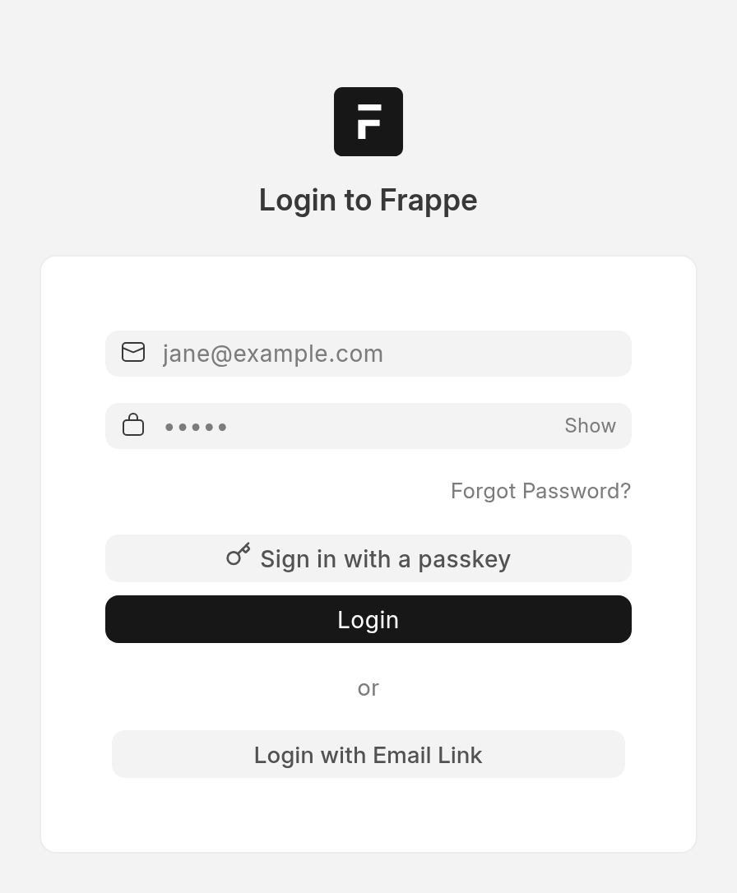
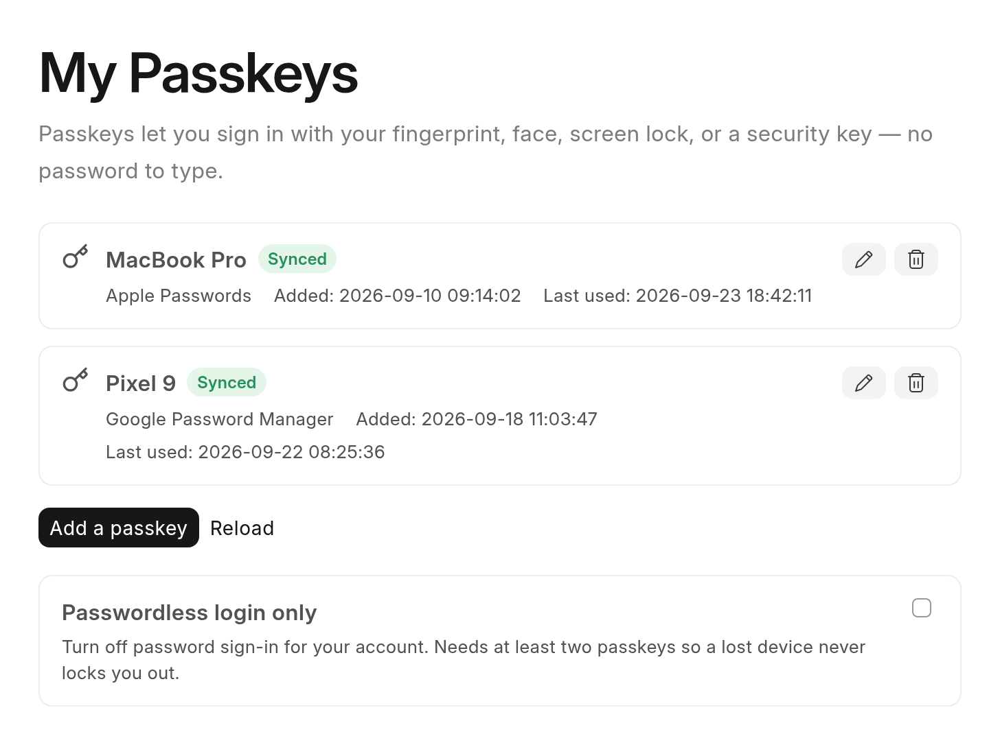
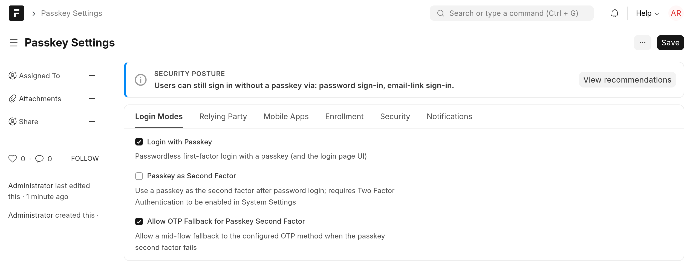

<div align="center" markdown="1">
	
	<h1>Passkeys for Frappe</h1>

**Passwordless, phishing-resistant WebAuthn authentication for Frappe — built to merge into core**
</div>

<div align="center">
	<a target="_blank" href="LICENSE" title="License: MIT"></a>
	<a href="https://github.com/Andrometiq/frappe-passkeys/actions/workflows/ci.yml"></a>
	
	
</div>

<div align="center">
	
</div>

## Passkeys for Frappe

Passkeys bring [WebAuthn / FIDO2](https://fidoalliance.org/passkeys/) authentication to any Frappe
site — the same fingerprint, face, screen-lock, or security-key sign-in people already use with their
Apple, Google, and Microsoft accounts. It is built to be **mergeable into Frappe core**: no
monkeypatching, one codebase across v15 / v16 / develop, and a layout that mirrors its intended home
in `frappe/frappe`.

The app adds three independent capabilities. The two login modes are switchable and ship **off**;
action confirmation is a developer primitive that stays available for any app to build on.

### Key Features

- **Passwordless login** — a discoverable-credential ("passkey") sign-in on the login page, with
  conditional UI (autofill), an explicit button, and cross-device (hybrid / QR) support.

- **Passkey as a second factor** — after a password, a passkey step-up that speaks Frappe's own
  two-factor envelope, with a mid-flow one-time-code fallback.

- **Action confirmation** — `@passkey_protected` puts a fresh, single-use passkey confirmation on any
  sensitive whitelisted method, bound to the exact action and payload before it runs.

- **Native by design** — integration only through sanctioned hooks and whitelisted endpoints. When a
  future Frappe serves passkeys natively, the app detects it, refuses fresh installs, and no-ops so it
  uninstalls cleanly.

- **Secure by default** — every mode ships off; user verification and sign-count clone-detection are
  enforced, per-user and per-IP rate limits guard every ceremony, and a passkey-only account can never
  lock its last door.

<details>
<summary>Screenshots</summary>

**Self-service management** — users add, rename, and remove their own passkeys at `/passkeys`, and can
switch their account to passwordless-only.



**Administrator settings** — every mode stays off until an administrator turns it on, with a
one-way-door warning on the Relying Party ID.



</details>

## Installation

```bash
# Pick the branch that matches your Frappe version: version-15, version-16, or develop
bench get-app --branch version-16 https://github.com/Andrometiq/frappe-passkeys
bench --site <site> install-app passkeys
```

Installing is **not** enabling — every login mode ships off. Open **Passkey Settings**, review the
resolved Relying Party ID (changing it later invalidates every enrolled passkey), then enable the
modes you want.

### Supported versions

| Frappe | Supported | Notes |
| --- | --- | --- |
| **v15** | v15.107.0 and newer | The `webauthn` library needs `cryptography>=46` **and** `pyOpenSSL>=26`, which v15 ships together only from v15.107.0. A `before_install` guard aborts on anything older with a clear message. |
| **v16** | Yes | Ships the required `cryptography` / `pyOpenSSL` pins. |
| **develop** | Yes | Tracked continuously. |

Python `>=3.10` is required. See [`docs/install.md`](docs/install.md) for the full matrix and
reverse-proxy / RP-ID / origin requirements.

## Documentation

- [**Install**](docs/install.md) — install, upgrade, uninstall, the version matrix, and reverse-proxy
  / RP-ID / origin requirements.
- [**Configuration**](docs/configuration.md) — every Passkey Settings field, its default, and the
  security consequence of changing it.
- [**Operations**](docs/operations.md) — day-two playbooks: RP-ID / domain changes, backup / restore,
  incident response, revocation, and monitoring.
- [**Recovery**](docs/recovery.md) — locked-out user and locked-out admin recovery, with exact
  `bench console` commands.
- [**Security**](docs/security.md) — the security model in operator terms: what the app enforces, what
  it trusts, residual risks, and disclosure.
- [**Upstream**](docs/upstream/) — the plan and patches to move this into `frappe/frappe`.

## Development

```bash
cd apps/passkeys
pre-commit install
bench --site <site> run-tests --app passkeys   # server suite
node --test 'passkeys/tests/js/*.test.js'        # client-logic unit suite
```

The app carries a full server suite, a dependency-free JavaScript suite, and a Cypress end-to-end
suite; CI runs all three against Frappe v15, v16, and develop.

## Upstream intent

This app is a delivery vehicle for a native Frappe implementation. The layout mirrors the intended
core destination file-for-file, and [`docs/upstream/`](docs/upstream/) carries the two-stage merge
plan and the concrete patches. On a Frappe that serves passkeys natively, the app detects this,
refuses fresh installs, and every endpoint returns a typed "served by core" response so it can be
uninstalled cleanly.

## Contributing

Bug reports, fixes, and features are welcome. See [`CONTRIBUTING.md`](CONTRIBUTING.md) for the branch
model, commit-message conventions, and how to run the test suites.

## License

[MIT](LICENSE)

<br>
<div align="center">
	Made for the <a href="https://frappe.io">Frappe</a> community.
</div>
